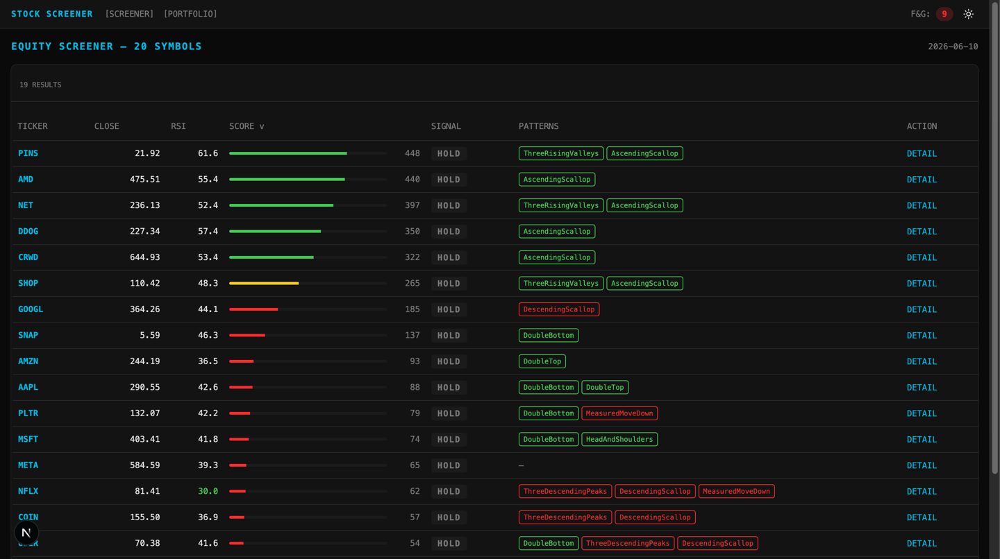
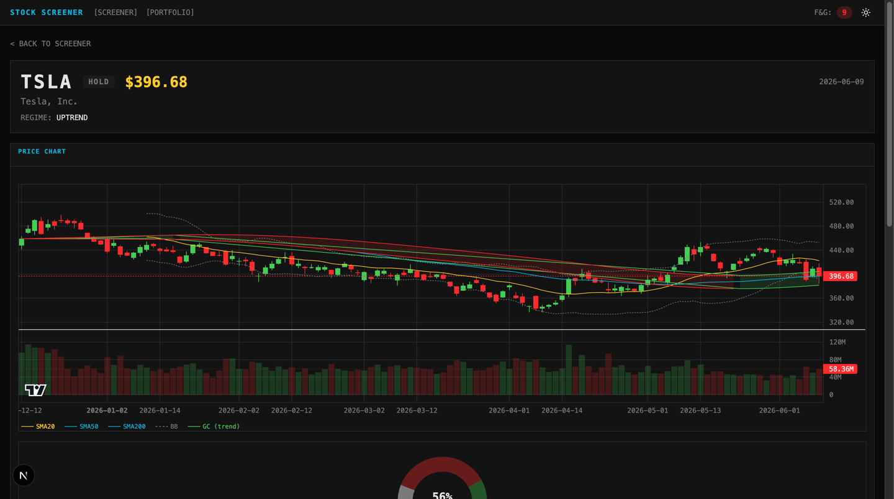

# Stock Checker

A bun-workspaces monorepo that screens US equities with an institutional-flow
signal engine, visualizes them in a web UI, and validates every strategy change
with a backtest.

| Package | What it is |
|---|---|
| `packages/core` | Signal engine, backtest, and CLI (`predict` / `learn` / `optimize` / `backtest`) |
| `apps/api` | Fastify API server (screener, ticker detail, OHLCV) — port 3001 |
| `apps/web` | Next.js 16 screener UI (candlestick + Gaussian Channel band charts, portfolio, light/dark) — port 3000 |

| Screener | Ticker detail (Gaussian Channel band) |
|---|---|
|  |  |

## Signal philosophy

The engine follows the principles in [docs/TRADING_PRINCIPLES.md](docs/TRADING_PRINCIPLES.md):
price, volume, VWAP, moving averages, liquidity, relative strength, and earnings
revisions over oscillator soup.

- **Trend regime** — Gaussian Channel (green = uptrend, red = downtrend) gates all buys.
- **Institutional flow score** — relative strength vs SPY and the sector ETF,
  VWAP accumulation, breakout volume, dollar-volume liquidity, earnings revisions.
- **Leader-pullback entry (주도주 눌림목)** — BUY only when a name that is
  outperforming both the market and its sector pulls back below its 50-day SMA
  on a calm, weak-close bar with real participation. Backtested (5y, 121
  tickers, real pipeline): **65.1% 5-day win rate / 1.36 reward-risk** vs the
  52.5% / 1.09 ungated baseline.
- **SELL = exit discipline, not a downside prediction** — distribution-day
  SELLs are suppressed inside intact uptrends and only fire when the trend
  itself is broken.
- Classic indicators (RSI, Stochastic %K, Bollinger, Donchian, Williams %R,
  MACD, ATR, volume ratio, Fear & Greed) are still computed and displayed, but
  they season the score rather than drive it.
- Volatility-adjusted risk levels per signal: 1.5×ATR stop loss, 2× reward
  take profit, trailing stop that activates after a 0.5×ATR move.

## Usage

Tooling is managed by [mise](https://mise.jdx.dev); tasks wrap every common
operation (run `mise tasks` to see them all).

```bash
mise install        # pin runtimes (node 24, bun)
bun install         # install workspace deps + git pre-commit hook
mise run dev        # API (3001) + Web (3000) dev servers in parallel
```

### CLI (packages/core)

```bash
# Daily prediction for a ticker list (default command)
mise run predict -- --ticker=TSLA,PLTR --sort=asc

# Slack notification for BUY/SELL opinions (either form)
SLACK_WEBHOOK_URL=https://hooks.slack.com/services/XXX mise run predict -- --ticker=TSLA,PLTR
mise run predict -- --ticker=TSLA,PLTR --slack-webhook=https://hooks.slack.com/services/XXX

# Strategy validation & tuning
mise run backtest        # version comparison, goal search, SELL validation
mise run optimize        # parameter optimizer (positional symbol, e.g. TSLA)
mise run learn           # learn from prediction feedback
```

Each `predict` run appends rows to a monthly CSV in `packages/core/public/`
(e.g. `stock_data_202511.csv`), tickers in alphabetical order (`--sort=desc`
reverses).

### Quality gate

```bash
mise run ci          # lint → typecheck → test → build
```

## Automation

- `.github/workflows/daily-data.yml` — runs `predict` after US market close and
  auto-commits the monthly CSV.
- `.github/workflows/weekly-optimize.yml` — weekly parameter optimization,
  results uploaded as a build artifact.
