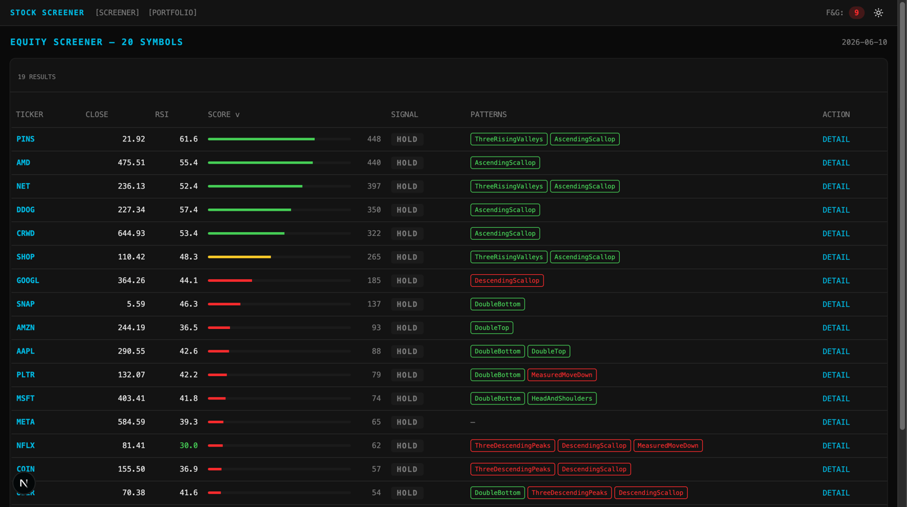
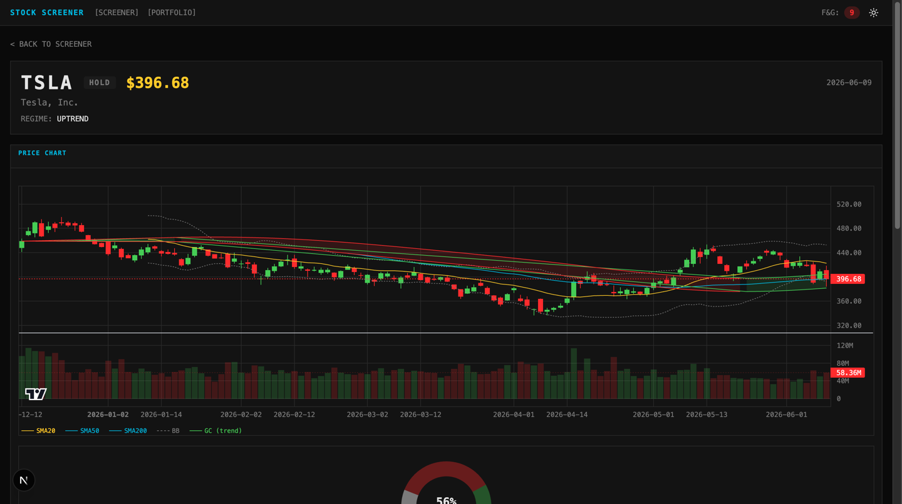

# Stock Checker

Stock Checker screens US equities with a shared signal engine, provides web
dashboards and local MCP analyst reports, and evaluates strategies against
historical data. The repository uses Bun workspaces.

| Package | What it is |
|---|---|
| `packages/core` | Signal engine, backtest, and CLI (`predict` / `learn` / `optimize` / `backtest`) |
| `apps/api` | Fastify API for ticker data, portfolio, watchlist, and durable market-screen jobs — port 5101 |
| `apps/web` | Next.js 16 dashboards, market-screen controls, charts, portfolio, watchlist, and alerts — port 5100 |
| `apps/mcp` | Local stdio MCP for analyst reports, signal screening, and chat/browser dashboards |
| `tools/finance` | Locked Python 3.14 environment, Ruff, Pyrefly, and offline finance regressions |

| Screener | Ticker detail (Gaussian Channel band) |
|---|---|
|  |  |

## Quick start

Install [mise](https://mise.jdx.dev), then run from this repository:

```bash
mise install        # Node 26, Bun 1.4.2, Python 3.14, uv 0.12.22
mise run install    # workspace dependencies and repository Git hooks
mise run dev        # API on 5101 and web on 5100
```

Open `http://localhost:5100`. For local Codex or Claude Code, reopen the client in
this repository to load the checked-in `stock_checker` MCP configuration. The
MCP can analyze tickers without running the web servers. Browser dashboards and
the web market-screen menu require `mise run dev`.

| Task | Start here |
|---|---|
| Read charts or manage a portfolio | [Web dashboard](#web-dashboard) |
| Ask for a ticker report, valuation, or analyst targets | [Ticker analyst reports](#ticker-analyst-reports) |
| Screen a selected list of up to 50 tickers | [Selected-ticker screening](#selected-ticker-screening) |
| Collect US-market candidates and run resumable SC analysis | [Finviz candidate screening](#finviz-candidate-screening) |
| Run predictions or evaluate a strategy | [CLI](#cli-packagescore) |
| Check dependencies, Python tools, or repository quality | [Development](#development) |

## Web dashboard

The header exposes these menus. The initial **SCREENER** covers the repository's
selected 20 symbols; **MARKET SCREEN** displays candidate jobs created through the
MCP/browser flow.

| Menu or page | Route | What it shows |
|---|---|---|
| SCREENER | `/` | Selected-ticker signals, scores, and sector heatmap |
| MARKET SCREEN | `/market-screen` | Saved Finviz jobs, source filters, coverage, progress, results, and pause/resume controls |
| PORTFOLIO | `/portfolio` | Portfolio ticker list and current analysis |
| WATCHLIST | `/watchlist` | Tracked tickers and current analysis |
| ALERTS | `/alerts` | Browser alert rules and notification settings |
| Ticker detail | `/:ticker`, for example `/OII` | Charts, current signal, fundamentals, earnings, news, and events |
| Ticker backtest | `/:ticker/backtest` | Historical strategy evaluation |

MCP and API processes in the same checkout share `data/market-scans/`. Opening
**MARKET SCREEN** reads saved jobs without starting analysis. Select a job to see
its filters and declared collection coverage, then inspect **MATCHED**,
**EXCLUDED**, or **UNAVAILABLE** results. **Resume** evaluates remaining
candidates; **Pause** stops new launches while in-flight analyses finish.
New candidate collection and job creation use the [MCP flow](#finviz-candidate-screening).

The job list refreshes every 15 seconds. The selected nonterminal job refreshes
every 5 seconds after each response; terminal jobs stop automatic detail polling.
Use **Refresh status** for another read. Job API requests bypass service-worker
caches, and failed detail refreshes mark the retained snapshot as stale and
disable controls until a refresh succeeds.

Each result links to live ticker detail. That page recalculates current data
with 730 calendar days of history, so it may differ from a saved job's session
date or chosen history window. Market-screen reference prices remain in USD,
independent of the header's display-currency selection.

Alert rules are stored in the browser and evaluated every five minutes while
the app or PWA is open. They do not provide a server-side alert service after
the app closes.

## Signal philosophy

The engine follows the principles in [docs/TRADING_PRINCIPLES.md](docs/TRADING_PRINCIPLES.md):
price, volume, VWAP, moving averages, liquidity, relative strength, and earnings
revisions. Oscillators provide supporting signals.

- **Trend regime** — the Gaussian Channel gate blocks BUY during a downtrend.
  Uptrend and sideways regimes still need to pass the other entry gates.
- **Institutional flow score** — relative strength vs SPY and the sector ETF,
  VWAP accumulation, breakout volume, dollar-volume liquidity, earnings revisions.
- **Strong-leader pullback entry (주도주 눌림목)** — the current rules require
  strong relative strength against both SPY and the ticker's sector, a calm
  pullback below the 50-day SMA, and a close near the bar's low. Missing or
  mismatched benchmark dates provide no relative-strength evidence.
- **SELL exit rules** — distribution-day
  SELLs are suppressed inside intact uptrends and only fire when the trend
  itself is broken.
- Classic indicators (RSI, Stochastic %K, Bollinger, Donchian, Williams %R,
  MACD, ATR, volume ratio) supplement the flow score. Bitcoin Fear & Greed is
  displayed separately and excluded from equity decisions.
- ATR measures price-range volatility over 14 sessions in price units. The
  default long references place the stop 1.5×ATR below the reference price and
  the target 3×ATR above it, a 2:1 reward-to-risk ratio. Trailing protection activates after
  a 0.5×ATR favorable move. Screening references use a completed close; calculate
  execution levels again from an actual next-session fill.

The default web/API/MCP evaluator uses `DEFAULT_QUALITY_PIPELINE_CONFIG`.
The CLI `predict` command merges stored per-ticker optimization settings into
`DEFAULT_PIPELINE_CONFIG`. An optimizer run therefore does not automatically
change web/MCP rules, and CLI predictions can differ from dashboard signals.
An institutional flow score contributes to the default strategy's scoring; its
standalone pass flag is not an additional hard BUY gate.

The default web/API/MCP BUY checks include:

| Check | Default criterion |
|---|---|
| Score | `200 ≤ buyScore < 400` and `buyScore ≥ sellScore` |
| Trend | Gaussian Channel regime is not `downtrend` |
| Pullback | Completed close is below SMA50 |
| Close location | `(close − low) / (high − low) < 0.2` |
| Volatility | `ATR14 / close × 100 < 3.5` |
| Volume participation | Latest-session volume / 20-session average is `> 0.8` and `< 99` |
| Relative strength | SPY and sector normalized components each reach `0.7` |
| Confluence | At least one confirmation indicator reaches its activation threshold |

Liquidity and VWAP contribute to scores. The optional Finviz market-cap, price,
and average-volume limits are candidate cuts, not additional engine BUY gates.
The implementation is defined in [the shared configuration](packages/core/src/constants.ts)
and [the signal pipeline](packages/core/src/services/pipeline.ts).

## Performance validation status

The previous **60.4% win rate / 1.28 reward-risk** figures are withdrawn as
validation of the current implementation. The finance audit found next-session
information in historical benchmark inputs, same-close entries after close-based
signals, inconsistent indicators and corporate-action adjustments, and a
holdout period reused to rank candidate configurations. The archived figures in
[docs/TRADING_PRINCIPLES.md](docs/TRADING_PRINCIPLES.md) describe exploratory
runs of the previous implementation.

The corrected fixed-hold evaluator enters at the next session's open, exits after
five trading sessions including the entry session, and charges 10 bps per round
trip. The equity curve marks open positions at each daily close, including
intervening losses. Signal statistics can include overlapping observations;
the single-position equity curve accepts only non-overlapping trades. Its
maximum drawdown uses daily closing marks and does not measure intraday losses.

Historical OHLC fields use the same split/dividend-adjusted scale when the
provider supplies adjustment data. Bitcoin Fear & Greed is displayed as Bitcoin
sentiment and contributes no evidence to US equity signals. Estimate revisions
compare the same forecast period over time, rather than different quarters.
BUY/SELL/HOLD percentages are score weights, not proven trade-success probabilities.

The learning evaluator compares consistently adjusted daily closes over five
subsequent observed trading sessions. Its ±2% BUY/SELL hit rate measures direction,
and its fitted Brier score is in-sample; neither measures executed net profit.

A new broad-universe, cost-adjusted, untouched out-of-sample evaluation is required
before publishing a performance claim. Current ticker/sector mappings still carry
survivorship and classification bias, and historical earnings information is not
available as a point-in-time series. Live snapshots also lack the historical
engine's cluster state, so repeated BUY displays are not separate backtested
entries. The code fixes have regression coverage;
they do not establish a profitable strategy.

## Development

Tooling is managed by [mise](https://mise.jdx.dev); tasks wrap every common
operation (run `mise tasks` to see them all).

Check and update workspace dependencies with `mise run deps:outdated` and
`mise run deps:update`. The updater visits each workspace sequentially so they
share one lockfile. Type checks use the TypeScript 7 native `tsc`; the
`typescript` import uses the official [TypeScript 6 compatibility package](https://devblogs.microsoft.com/typescript/announcing-typescript-7-0/#running-side-by-side-with-typescript-6.0) for
tools such as Next.js that need the JavaScript compiler API.

The app and its optimizer run in TypeScript. The managed financial-analysis
skills use Python. Their dependencies are locked separately in
`tools/finance/uv.lock` and run with Python 3.14:

```bash
mise run finance:install
mise run finance:deps:outdated
mise run finance:deps:update
mise run finance:lint         # Ruff lint
mise run finance:format:check # Ruff formatting check
mise run finance:fix          # safe lint fixes, then formatting
mise run finance:typecheck    # Pyrefly, targeting Python 3.14
mise run finance:test         # offline regression tests
mise run finance:run -- .codex/skills/stock-analysis/scripts/analyze_stock.py --help
mise run finance:run -- .codex/skills/backtesting-trading-strategies/scripts/backtest.py --help
```

`finance:run` invokes Python inside the locked project environment, including
for scripts with inline uv metadata.
`mise run lint` includes Ruff lint and formatting checks, `mise run typecheck`
runs Pyrefly, and `mise run test` includes the Python regressions. These checks
also run in GitHub Actions when the finance dependencies or scripts change.

The pre-commit hook checks staged file contents with Biome and leaves file contents
and staging unchanged. Fix reported issues and stage the changes before retrying
the commit. The commit-message hook checks co-author addresses against the
repository allowlist.

## Releases

Every `main` push runs [Release Please](.github/workflows/release.yml). It creates
or updates a release PR, synchronizes the root and four workspace versions plus
`bun.lock`, and runs lint, type checks, and offline tests against that exact PR
commit. Passing release PRs are squash-merged automatically; the same workflow
then creates the `vX.Y.Z` tag and GitHub Release. No additional token or secret is
required. MCP server discovery reads its version from its package manifest.
The daily stock-data workflow explicitly starts Release Please after committing
changed CSVs, so its GitHub-token push also reaches the versioning flow. Weekly
optimization uploads artifacts and does not commit to `main`.

Use Conventional Commits: `feat:` increments the minor version, `fix:` increments
the patch version, and `!` or a `BREAKING CHANGE:` footer increments the major
version. Documented maintenance types (`docs`, `test`, `ci`, `chore`, `build`,
`perf`, `refactor`, `style`, and `revert`) also produce patch releases. Commits
without a recognized type produce no release by themselves. The first release
starts at `0.1.0`; its changelog starts when this automation was introduced.

The workflow merges only its generated same-repository release PR, after checking
that changes contain only release metadata and workspace versions. If quality
checks fail or `main` / the PR head changes during validation, the PR stays open.
A later `main` push or manual **Release Please → Run workflow** retries it. The
workflow also recovers a merged release whose tag creation previously failed.

Release configuration lives in [release-please-config.json](release-please-config.json)
and [.release-please-manifest.json](.release-please-manifest.json). Run
`mise run release:test` for the merge and lockfile regression checks. GitHub Actions
must allow creating pull requests under **Settings → Actions → General → Workflow
permissions**. If branch protection later adds required PR checks or reviews,
adapt this flow to satisfy those rules before enabling automatic releases.

## Configuration

Yahoo data does not require an API key. The data-provider keys below are optional;
set them in the launching process's environment or a private client configuration.

| Variable | Effect |
|---|---|
| `TIINGO_API_KEY` | Enables the [Tiingo](https://www.tiingo.com) daily-OHLCV fallback when Yahoo fails. Without it, unavailable OHLCV is returned as empty data. Provider quotas depend on the configured plan. |
| `SLACK_WEBHOOK_URL` | Slack notification for BUY/SELL opinions from `predict`. |
| `FMP_API_KEY` | Optional [FMP](https://site.financialmodelingprep.com/developer/docs) fallback for recent individual analyst price-target updates. Yahoo consensus and available Yahoo target updates work without it. |
| `STOCK_CHECKER_DASHBOARD_URL` | Base URL for the local MCP browser dashboard tool; defaults to `http://localhost:5100`. Accepts HTTP/HTTPS without credentials, query parameters, or fragments. |
| `API_URL` | Server-side web-to-API base URL; defaults through `NEXT_PUBLIC_API_URL` to `http://localhost:5101`. |
| `NEXT_PUBLIC_API_URL` | Client-visible API base URL; defaults to `http://localhost:5101`. Configure it for web clients that cannot reach that address. |
| `PORT` | Fastify listening port; defaults to `5101`. Update the web API URL when changing it. |
| `CORS_ORIGIN` | Allowed browser origin for the API. Defaults to `*` for ordinary API access; market-screen control requests use stricter origin rules described below. |

Restart the relevant process or MCP connection after changing its configuration.
`STOCK_CHECKER_DASHBOARD_URL` changes MCP browser links; it does not configure the
web application's API address. The public Finviz browser collection flow needs
no Finviz API key; Elite API/export access is a separate service.

## Local MCP (Codex and Claude Code)

After `mise install` and `mise run install`, reopen the client in this repository.
The project configurations register `stock_checker` through
`.codex/config.toml` for [Codex](https://developers.openai.com/codex/mcp/)
and `.mcp.json` for Claude Code. Executables and source paths are portable;
no personal interpreter path is stored in the repository. `mise run mcp` starts
the server over stdio; stdout carries JSON-RPC and logs go to stderr.

The checked-in configurations also include Serena through `oma` and browser
automation through `aside`. Those entries require their respective CLIs.
Ticker analysis itself does not require Aside; Finviz browser collection uses
an available browser MCP or a supplied authorized export.

### Tools

| Tool | Purpose | Starts work or opens a browser? |
|---|---|---|
| `analyze_stock` | Signal reasons, historical rates, ATR references, valuation, and analyst targets | Fetches ticker data; no browser |
| `show_stock_dashboard` | Analyst report and chart in an MCP Apps-capable chat client | Fetches ticker/chart data; no browser |
| `open_stock_dashboard` | Open the existing ticker web detail page | Opens the browser when a web listener is available |
| `screen_stocks` | Evaluate a bounded list using final SC decisions | Fetches data for the selected list |
| `prepare_finviz_screen` | Return the Finviz URL and collection instructions | Prepares metadata only |
| `create_market_screen` | Save a candidate manifest and create a durable job | Starts analysis by default; `autoStart: false` saves it paused |
| `get_market_screen` | Read progress, provenance, and a result page | Reads saved data only |
| `control_market_screen` | Pause or resume an existing job | `resume` starts remaining analyses |
| `get_market_screen_performance` | Read saved recommendation outcomes and their win-rate sample | Reads saved data only |
| `refresh_market_screen_performance` | Update a bounded batch of recommendation outcomes | Fetches later market prices explicitly |

### Ticker analyst reports

Ask the client, for example: `TSLA 분석해줘. 근거, 승률, 진입, 손절, 최근 목표가까지.`
It can call `analyze_stock` with:

```json
{"ticker":"TSLA","lookbackDays":2920}
```

The tool returns Markdown and structured data: current signal and gate reasons,
ATR risk reference prices, conditional next-session entry, historical five-session
net win rate, stop/target touch rates, available analyst targets, and PER/PSR
valuation. Lookback defaults to 2920 calendar days and accepts 730–3650.

Historical rates include observation counts, dates, and execution assumptions.
They are empirical frequencies, not calibrated forecasts. The fixed-hold win
rate charges 10 bps round trip; stop/target statistics are measured separately.
When a bar touches both levels and its open does not establish which was reached
first, ordering is reported as ambiguous.
An empty sample produces an unavailable rate. Historical signals still carry
the earnings, universe, and cluster-state limitations described above.

Analyst consensus and individual updates have separate source/date metadata.
Recent updates cover the last 90 days, with a 30-day count; a retrieved consensus
is not presented as a newly published analyst report. Forecast horizons and
consensus publication times may be unavailable, so target prices cannot be
treated as calibrated five-session forecasts. Missing data or provider
access is reported explicitly. Supply optional keys in the client's environment.

Valuation includes the stock's trailing PER and PSR, separate forward PER,
and medians from up to 12 Yahoo-selected US-region companies in the same industry.
The subject stock, duplicates, non-equities, and industry mismatches are excluded.
Each median requires at least three positive, finite peer values; missing data
returns `null`, and losses make trailing PER unavailable. The report includes
peer tickers, per-metric sample counts, coverage, relative premiums, sources, and
retrieval times. These are selected peer medians, not whole-industry averages.
Financial reporting periods may differ, and lower multiples alone do not change
the technical BUY/SELL decision. Valuation results are cached for 15 minutes.

Yahoo requires no API key. Codex forwards `FMP_API_KEY` and `TIINGO_API_KEY`
through `env_vars`; Claude's shared MCP configuration expands those environment
variables with an empty default. An explicit key can also be supplied through
`env` in a private user/local MCP configuration. For example, set
`env.FMP_API_KEY` in that private configuration. Without a key, Yahoo remains
the data source.

Check the MCP app with `mise run typecheck:mcp` and `mise run test:mcp`.

### Selected-ticker screening

For Stock Checker signal screening, ask `스톡체커 기준으로 BUY 후보 찾아줘`.
The client calls `screen_stocks`; an empty input uses the same 20 symbols as the
web screener and selects final `BUY` decisions. Specify a ticker list to scan
your own candidates:

```json
{"tickers":["AAPL","TSLA","NVDA","OII","SPCX"],"decision":"BUY","limit":20}
```

The tool uses the existing signal engine and entry gates. A high BUY score alone
does not qualify a ticker when the engine's final decision is HOLD. Matches
include completed-session dates, scores, gate reasons, and ATR risk references.
Entry remains conditional on the next session's open; the future fill price is
unknown. SELL screening describes long-holder exit warnings.

Inputs allow 1–50 symbols, with case normalization and deduplication. `decision`
can be `BUY` (default), `SELL`, `HOLD`, or `ALL`. Lookback defaults to 730 calendar
days, matching the web screener, and accepts 730–3650; `limit` accepts 1–50 and
defaults to 20. Results sort by BUY score descending, or SELL score for SELL
screening, with ticker order breaking ties. Coverage includes the total matches
before truncation, other decisions, and unavailable symbols. A completed scan
with no matching BUY is a normal result.

At most two ticker analyses run concurrently. The scan has a 45-second time
budget; unfinished symbols are reported as unavailable and already completed
results are retained. This is a scan of the stated symbol list, not a whole-market
search. For a selected candidate's historical win/stop-touch rates, valuation,
and analyst targets, call `analyze_stock` or `show_stock_dashboard`.
Pass the screen's `lookbackDays` to that follow-up call when comparing decisions;
the detailed tools otherwise default to 2920 days.

### Finviz candidate screening

The pipeline has two passes:

1. **Candidate collection:** prepare filters, open Finviz in an available browser
   MCP, and collect ticker rows with source metadata.
2. **SC evaluation:** freeze that list in a durable job and apply the existing
   completed-session signal engine to each candidate. A Finviz match is not a
   final SC BUY decision.

For candidates across the US market, ask `Aside로 Finviz 후보를 모아서 스톡체커 BUY 기준으로 평가해줘`.
The client calls `prepare_finviz_screen` to prepare a public Finviz Tickers-view
URL, then uses an available browser MCP such as Aside to collect its symbols.
The BUY default excludes funds and selects price below SMA50, reflecting the
current SC pullback requirement. Market-cap, average-volume and price cuts default
to `any`; these are optional candidate filters. Disable
the SMA50 prefilter to collect a broader list:

```json
{"belowSma50":false}
```

For a smaller liquidity-focused candidate set, optionally add
`marketCap: "over2b"`, `averageVolume: "over500k"`, and `price: "over5"`.
For SELL, HOLD or ALL, pass `decision` to preparation; the BUY-specific SMA50
prefilter is then off unless explicitly requested. Use the same decision when
creating the analysis job.

Finviz selects the candidate universe; the existing Stock Checker final decision
determines BUY. SC recomputes completed-session trend, relative strength against
SPY and the sector ETF, SMA50, close location, ATR%, volume participation, confluence
and final scores. Finviz may use an intraday quote and different price adjustments;
its relative volume uses a different average period, so it is not substituted for
the SC volume gate. These prefilters can exclude other stocks with a BUY signal.
Finviz covers US exchanges, rather than all global stocks. The public browser
route needs no Finviz API key; its [API/export access is an Elite feature](https://finviz.com/help/faq).
`prepare_finviz_screen` returns a plan; it does not fetch Finviz pages or open
their browser tabs. The client performs collection through its browser MCP.
Clients without a browser MCP can supply ticker rows from an authorized browser
or CSV export.

#### Create a saved job

After collection, call `create_market_screen` with the ticker manifest and source
metadata. For example, an intentionally partial two-symbol preview is:

```json
{
  "tickers": ["A", "AA"],
  "provenance": {
    "source": "Finviz",
    "url": "https://finviz.com/screener?v=411&f=cap_midover,ind_stocksonly,sh_avgvol_o500,sh_price_o5",
    "filters": ["cap_midover", "ind_stocksonly", "sh_avgvol_o500", "sh_price_o5"],
    "sourceTotal": 1669,
    "capturedAt": "2026-10-04T05:00:00Z",
    "completeness": "partial"
  },
  "autoStart": false
}
```

The count above is an example from one collection, not a current universe size.
This example uses optional liquidity cuts without the SMA50 prefilter. Use the
URL and filters from `prepare_finviz_screen` for your chosen screen, and supply
the actual displayed filtered total and capture time. Inputs accept up to
15,000 rows before normalization and deduplication. `complete` requires the unique
symbol count to equal the stated filtered total; this checks count consistency,
not independent verification of the caller's Finviz collection. Record missing
pages or security checks as `partial`. Preserve the source URL's exact ordered
filter identifiers. Optional `overallTotal` and `pages` describe the unfiltered
Finviz count and collected page count separately.

Creation normally starts background analysis and immediately returns the job ID.
`autoStart: false` saves a paused manifest without market-data calls.

#### Read, pause, and resume

Replace `JOB_ID` with the UUID returned by `create_market_screen`:

```json
{"jobId":"JOB_ID","kind":"matches","offset":0,"limit":20}
```

Pass that input to `get_market_screen`. Optional `kind` selects `matches`,
`excluded`, or `unavailable`; `offset` and `limit` control pagination. The default
page is 20 matches, with a maximum of 100 rows. To control the same job, call
`control_market_screen` with either input:

```json
{"jobId":"JOB_ID","action":"resume"}
```

```json
{"jobId":"JOB_ID","action":"pause"}
```

Pause stops new symbols while existing calls finish and save their results.
Resume keeps completed symbols and reclaims interrupted work after an MCP
restart; it does not automatically rerun unavailable symbols.

| Job status | Meaning |
|---|---|
| `paused` | No new candidates are launched; in-flight requests may still finish |
| `running` | A live worker owns the job and evaluates remaining candidates |
| `completed` | The complete supplied list finished with no unavailable analyses |
| `partial` | The supplied list finished, but collection was partial or some analyses were unavailable |
| `unavailable` | The supplied list finished without any usable analysis |

These statuses describe the supplied manifest. `completed` does not independently
verify that every US-listed stock, or every Finviz candidate, was collected.
Progress counts distinguish analyzed, unavailable, pending, in-flight, matched,
and excluded symbols. Scores are signal strengths; historical win and stop-touch
rates require a ticker report.

Jobs and atomic checkpoints live in ignored `data/market-scans/`, anchored to the
repository rather than the client's working directory. A shared process lock
allows one active job across local Codex/Claude connections and the web API,
with at most two concurrent ticker analyses and a one-second minimum interval
per worker. A busy job stays paused until explicitly resumed. Rate-limit errors
or five consecutive unavailable analyses pause new requests; this general availability guard also
handles provider errors that the data layer converts into empty data. The guard
does not identify every data failure as rate-limiting. The 45-second `screen_stocks` budget
does not apply to these background jobs; the process that resumes the job (MCP
or API) must remain running.
Analysis completion and source collection coverage are reported separately.
Results retain per-symbol session dates because a long scan may span market days.
Use the job's history window for candidate detail reports. If the runner process
exits, restart it and explicitly resume the saved job; simply opening the web
page or reconnecting the MCP does not restart analysis.

#### Forward paper performance

New matched BUY recommendations retain their recommendation time and signal
session. Their forward paper outcomes are measured separately from the ticker
report's historical backtest rates. Existing recommendations recorded before
tracking was introduced are identified as untracked legacy records and excluded
from the new validation sample.

The fixed policy uses the next regular US trading session's open as a simulated
entry and the fifth trading session's completed close, including the entry
session, as the exit. Net return subtracts 10 bps (0.1%) in total round-trip
costs. A positive net return is a win; a negative return is a loss. Recommendations
issued after their intended entry open are ineligible for this policy.
Entry and exit use the same fetched adjustment scale. The five-session policy
holds through ATR stop/target touches; its return measures the fixed holding
period rather than an early stop or target exit.
The scheduler uses the [published NYSE calendar](https://www.nyse.com/trade/hours-calendars)
for 2026–2028, including holidays and early closes. Windows outside that verified
calendar remain unavailable until calendar support is updated.

Only completed outcomes enter the win-rate denominator. Pending entries, open
positions, missing prices, and provider errors remain separate. With no completed
sample, the win rate is unavailable. The summary reports sample size alongside
wins, losses, and average net return; this average is not a portfolio return.
These are paper observations from market prices, not brokerage fills.

The web **MARKET SCREEN** page and `get_market_screen_performance` read cached
outcomes. Use **Refresh performance** or `refresh_market_screen_performance` to
update a bounded batch explicitly. Reads do not start scans or fetch later
prices. Completed outcomes stay fixed across subsequent refreshes and restarts.

Replace `JOB_ID` with the saved job UUID. Read its performance through
`get_market_screen_performance`:

```json
{"jobId":"JOB_ID","offset":0,"limit":20}
```

Request a batch update through `refresh_market_screen_performance`:

```json
{"jobId":"JOB_ID","limit":20}
```

Each update processes at most 50 recommendations, with a default batch of 20.
Read the returned refresh status and use another update for remaining records.

#### Market-screen API

The [web dashboard](#web-dashboard) uses these endpoints:

| Method | Path | Response |
|---|---|---|
| GET | `/api/market-screens?offset=0&limit=20` | Saved job page: `jobs`, `offset`, `limit`, `total`, `hasMore` |
| GET | `/api/market-screens/:jobId?kind=matches&offset=0&limit=20` | Job summary and a page of `matches`, `excluded`, or `unavailable` results |
| POST | `/api/market-screens/:jobId/resume` | Current snapshot after requesting resume |
| POST | `/api/market-screens/:jobId/pause` | Current snapshot after requesting pause |
| GET | `/api/market-screens/:jobId/performance?offset=0&limit=20` | Cached forward paper summary and paginated recommendation outcomes |
| POST | `/api/market-screens/:jobId/performance/refresh` | Updated performance snapshot after an explicit bounded refresh |

GET endpoints default to `offset=0` and `limit=20`; `limit` accepts 1–100.
Result offsets are bounded to 0–15000. Job lists are sorted by creation time,
newest first. Result ranking follows the job's decision filter. Pause/resume endpoints
accept no body or an empty JSON object `{}`; unknown query parameters or control
options return `400`. Invalid UUIDs return `400`, missing jobs `404`, and rejected
browser control origins `403`. Performance refresh accepts an optional
`limit` of 1–50, defaulting to 20.

```bash
# Read saved jobs without starting analysis
curl 'http://localhost:5101/api/market-screens?offset=0&limit=20'

# Read unavailable results for a saved job; replace JOB_ID
curl 'http://localhost:5101/api/market-screens/JOB_ID?kind=unavailable&offset=0&limit=20'
```

Job responses bypass browser/service-worker caches so old checkpoints are not
presented as current progress. Browser controls accept a specific `CORS_ORIGIN`
when configured. When unset or `*`, they accept local web origins (`localhost`,
`127.0.0.1`, or `[::1]` on port 5100) or the API's own origin. HTTP clients without
an `Origin` header are accepted. Local MCP access continues to use stdio.

### Dashboard in chat

For an interactive dashboard inside chat, ask `SPCX 대시보드를 채팅 안에 보여줘`.
The client calls `show_stock_dashboard` with the same ticker/lookback input as
`analyze_stock`. The tool links `ui://stock-checker/dashboard`, a self-contained
MCP Apps HTML resource (`text/html;profile=mcp-app`), and returns the report plus
up to 300 completed daily candles from a separate 365-day chart request.
The chart supports 1/3/6/12-month ranges, candles or a closing-price line,
volume, and pointer/keyboard OHLC inspection. The dashboard also shows the
signal, conditional execution references, historical rates with sample counts,
TTM/forward valuation, peer comparisons, and analyst targets.

The inline dashboard needs no Next.js/API server and loads no external scripts,
fonts, or network assets. Rendering requires a client with MCP Apps support;
clients without that support receive the full Markdown report and an optional
web detail link. Exposing the app resource does not prove that a particular
client renders it. Missing chart data preserves the available report.

### Dashboard in the browser

To open a ticker's existing web detail dashboard, start the API and web servers
with `mise run dev`, then ask `SPCX 대시보드 열어줘`. The client can call:

```json
{"ticker":"SPCX"}
```

Use the `open_stock_dashboard` tool for this request. It returns the ticker URL
and opens the default browser on the computer running the local MCP server.
It checks for a web listener before opening; this check does not verify market
data or API availability. If the web server is stopped, the tool returns the
link and startup instructions. It does not start development servers.
The web detail screen shows the existing charts, signals, fundamentals and
events; the full analyst report is returned separately by `analyze_stock`.
Analyzing a ticker alone does not open a browser.

Codex forwards `STOCK_CHECKER_DASHBOARD_URL` from the environment; Claude uses
the same variable with the default URL above. Private local MCP `env` settings
can override it. Restart the MCP connection after changing its configuration.

## CLI (packages/core)

```bash
# Daily prediction for a ticker list (default command)
mise run predict -- --ticker=TSLA,PLTR --sort=asc

# Slack notification for BUY/SELL opinions (either form)
SLACK_WEBHOOK_URL=https://hooks.slack.com/services/XXX mise run predict -- --ticker=TSLA,PLTR
mise run predict -- --ticker=TSLA,PLTR --slack-webhook=https://hooks.slack.com/services/XXX

# Strategy validation & tuning
mise run backtest        # version comparison, goal search, SELL validation
mise run backtest -- --cost-bps=20   # vary the round-trip cost (default 10bps)
mise run backtest -- --quick         # stop after version comparison + gate tuning
mise run optimize -- TSLA --trials 200  # noninteractive per-ticker optimization
mise run learn           # learn from prediction feedback
```

The default CSV prediction mode appends successful ticker rows to a monthly file
in `packages/core/public/` (e.g. `stock_data_202610.csv`), with tickers sorted
alphabetically (`--sort=desc` reverses). `--format=json` exports JSON instead;
other prediction modes can return without writing CSV rows.

## Quality checks

```bash
mise run lint        # Biome, Ruff lint, and Ruff formatting check
mise run typecheck   # TypeScript no-emit checks and Python Pyrefly
mise run test        # core, API, web, MCP, and offline Python regressions
```

Scoped tasks include `typecheck:core`, `typecheck:api`, `typecheck:web`,
`typecheck:mcp`, `test:core`, `test:api`, `test:web`, and `test:mcp`.
The Python checks are listed under [Development](#development).
`mise run ci` additionally requests the build tasks; it is not needed for the
offline quality checks above.

## Automation

- `.github/workflows/daily-data.yml` — runs daily at 23:00 UTC, including weekends,
  for its configured 15 tickers and commits the monthly CSV. This list differs
  from the web screener's selected 20 symbols.
- `.github/workflows/weekly-optimize.yml` — runs Sundays at 02:00 UTC, optimizes
  TSLA with 50 trials, and uploads configuration artifacts. It does not commit
  them or automatically change web/MCP signals.
- `.github/workflows/quality.yml` — lint, type checks, and offline tests for
  application and workspace changes, including the local MCP.
- `.github/workflows/python-typecheck.yml` — Ruff, Pyrefly, and pytest for
  Python finance dependencies and managed script changes.
